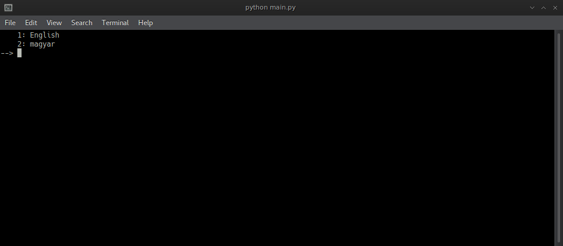
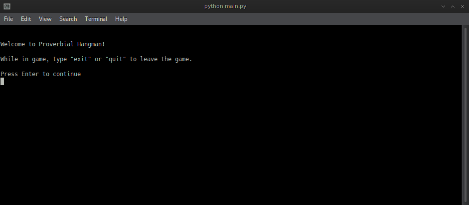
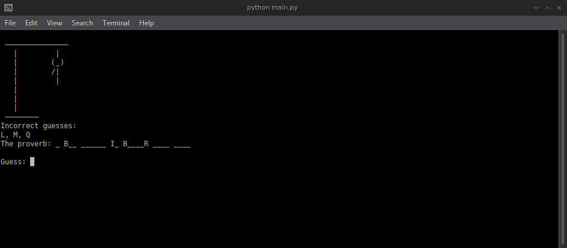
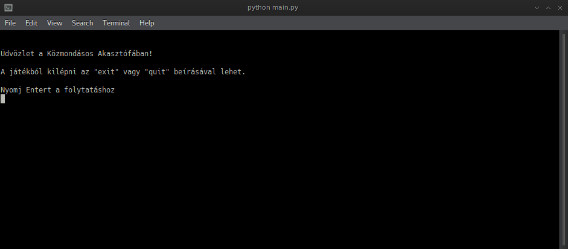
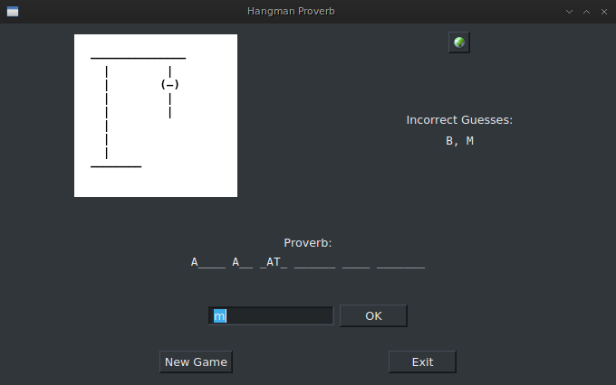
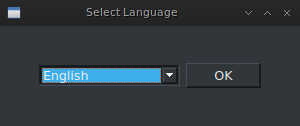

## Proverbial Hangman
Requires: Python 3.6 and either PySide or PySide2. 
Tested on Linux only.

A simple hangman game that runs in the command line. 
Figure out a proverb by guessing
letters. If you guess a letter that's not in the
proverb and you've already guessed it, you get
a penalty. 
The game ends when you guess all letters
correctly or when the hangman is finished.

It has almost 500 proverbs, in English and Hungarian. 
To play, simply run hangman.py

A simple GUI was made using PySide and PySide2.
If PySide2 cannot be imported, it falls back to PySide. 
To play, run hangman-pyside.py

At first start, a language selector window will pop up. Later it'll
be accessible by clicking on the small button with the globe icon.

### Screenshots

  
 
 
 
  
